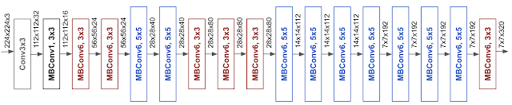

# EuroSAT Image Classification

## Data

This data is a publically available dataset for Sentinel2 images categorised into 10 types.

1. Annual Crop
2. Forest
3. HerbaceousVegetation
4. Highway
5. Industrial
6. Pasture
7. PermanentCrop
8. Residential
9. River
10. SeaLake

We use the RGB images for this project.

## Model Architecture

I tried the following different architectures.

1. ResNet-50
2. ResNetV2-50
3. EfficientNetB2 - Currently from SOTA model family in Image classification.

Optimizer: RMSProp, lr = 1e-4

Here I only demonstrate EfficientNetB2.

## Usage

Download the model weights [here](https://drive.google.com/file/d/1tZ0lSkr0B8TQM6GgPxamVDS-T_A2WXtB/view?usp=sharing)

`python predict.py image_path model_path`

## Results

My model achieves accuracy of 97.14% on my test set. (10% of initially seperated data)

## Future Work and Questions

1. Image pre-processing: Could be a step to de-haze or adding noise an image to augment the data.
2. Context: Since these images were cropped from a larger image, we lose some information from the surrounding crops. We can use context embeddings from the larger image to give more context to this model. This could take into account the effect of a nearby sea, river, other physical factors that are not in this image.
3. Use bigger models to get better accuracy.
